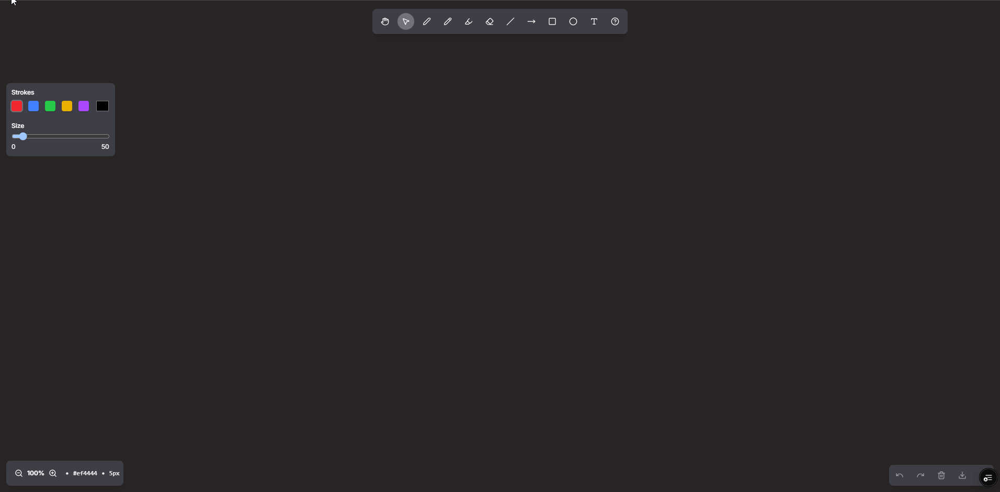

# Draw Board

A modern, feature-rich whiteboard application built with React and CSS (Tailwind). Perfect for sketching, note-taking, presentations, and digital art creation.


[](https://pry-draw-board.vercel.app/)

## ✨ Features

### Drawing Tools
- **👋 Hand Tool** - Pan and navigate the canvas freely
- **✔️ Choice Tool** - Select and manipulate objects
- **🖊️ Pen Tool** - Solid, precise lines for detailed work
- **✏️ Pencil Tool** - Softer, semi-transparent strokes
- **🖍️ Highlighter** - Thick, translucent lines for emphasis
- **🧽 Eraser** - Remove content with adjustable size
- **📏 Line Tool** - Draw straight lines with precision
- **➡️ Arrow Tool** - Create directional arrows for diagrams
- **⬛ Rectangle Tool** - Draw perfect squares/rectangles
- **⭕ Circle Tool** - Create ellipses or perfect circles
- **🔤 Text Tool** - Add customizable text labels
- **🧽 Eraser** - Remove content with adjustable size

### Customization Options
- **🎨 Color Palette** - 7 preset colors plus custom color picker
- **📏 Brush Size Control** - Adjustable from 1px to 50px
- **🌗 Theme Modes** - White board and dark board options
- **💾 History Management** - Full undo/redo functionality

### User Interface
- **📱 Responsive Design** - Works on desktop, tablet, and mobile
- **🎯 Floating Controls** - Intuitive, non-intrusive interface
- **🎮 Touch Support** - Native touch drawing for mobile devices

[](https://pry-draw-board.vercel.app/)

## 🚀 Quick Start

### Option 1: Direct Use
1. Download the HTML file
2. Open in any modern web browser
3. Start drawing immediately!

### Option 2: Local Development
```bash
# Clone or download the file
git clone https://github.com/fiqryx/draw-board.git
# and
npm install
# then
npm run dev
```

## 🎮 How to Use

### Basic Drawing
1. **Select a Tool** - Click on pen, pencil, highlighter, or eraser
2. **Choose a Color** - Click any color from the palette or use custom picker
3. **Adjust Size** - Use the slider to set brush thickness
4. **Start Drawing** - Click and drag on the canvas

### Keyboard Shortcuts
- `Ctrl/Cmd + Z` - Undo (planned feature)
- `Ctrl/Cmd + Y` - Redo (planned feature)
- `Ctrl/Cmd + A` - Clear canvas (planned feature)

### Tool Behaviors
- **Pen**: Solid, opaque lines - perfect for writing and precise drawing
- **Pencil**: 70% opacity with reduced width - ideal for sketching
- **Highlighter**: 2x width with 30% opacity - great for emphasis
- **Eraser**: 2x width with destination-out blend mode - removes content

### Browser Support
- ✅ Chrome 88+
- ✅ Firefox 85+
- ✅ Safari 14+
- ✅ Edge 88+
- ✅ Mobile browsers (iOS Safari, Chrome Mobile)

### Performance Features
- Efficient canvas rendering
- Optimized touch event handling
- Minimal memory footprint

## 📱 Mobile Experience

The whiteboard is fully optimized for mobile devices:
- Touch-friendly interface with larger buttons
- Responsive floating panels
- Native touch drawing support
- Automatic canvas scaling

## 🔧 Customization

## 🎯 Use Cases

- **Education**: Digital blackboard for online teaching
- **Presentations**: Live sketching during meetings
- **Art & Design**: Digital sketching and ideation
- **Note-taking**: Visual note-taking and mind mapping
- **Collaboration**: Shared whiteboard sessions (with backend)

<!-- ## 🚧 Roadmap

### Planned Features
- [x] Shape tools (rectangle, circle, line)
- [ ] Text tool with font selection
- [ ] Layer management
- [ ] Save/export functionality (PNG, SVG, PDF)
- [ ] Real-time collaboration
- [ ] Keyboard shortcuts
- [ ] Grid/ruler overlay
- [ ] Image import and annotation
- [ ] Vector drawing mode

### Performance Improvements
- [ ] Canvas optimization for large drawings
- [ ] History compression
- [ ] WebGL acceleration option -->

## 🤝 Contributing

Contributions are welcome! Here's how to get started:

1. Fork the repository
2. Create a feature branch (`git checkout -b feature/amazing-feature`)
3. Commit your changes (`git commit -m 'Add amazing feature'`)
4. Push to the branch (`git push origin feature/amazing-feature`)
5. Open a Pull Request

### Development Guidelines
- Follow existing code style
- Test on multiple browsers
- Ensure mobile compatibility
- Add comments for complex logic

## 📄 License

This project is licensed under the MIT License - see the [LICENSE](LICENSE) file for details.

## 📞 Support

If you encounter any issues or have questions:
- Check the [Issues](../../issues) page
- Create a new issue with detailed description
- Include browser version and steps to reproduce

---

*Happy Drawing! 🎨*